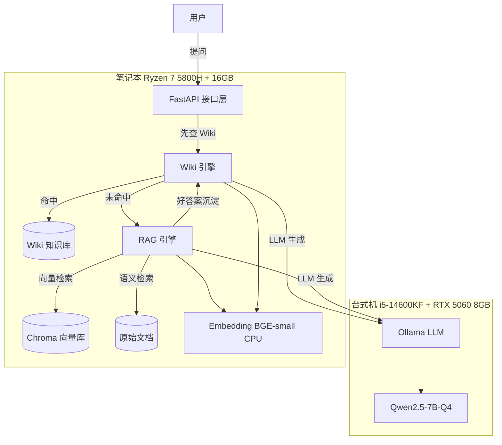
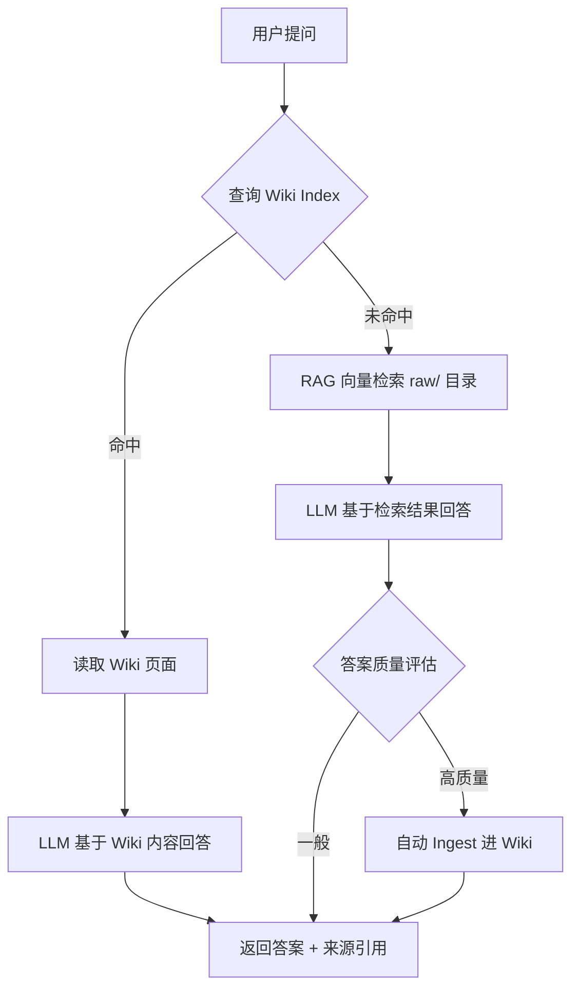

# 企业智能知识问答系统 - 技术方案设计

## 项目概述

### 项目名称
Wiki-RAG 双引擎企业知识问答系统

### 项目目标
构建一套企业内部知识管理 + 智能问答系统，解决企业知识散落、重复提问、知识流失的问题。

### 解决的核心痛点
1. **知识散落**：文档分布在各个平台（共享盘、邮件、聊天记录），检索困难
2. **知识不积累**：每次问 AI 都是从头检索，高质量答案随对话消失
3. **知识流失**：员工离职带走隐性知识，没有系统化沉淀
4. **重复回答**：同一个问题被不同人反复问，效率低下

---

## 系统架构

### 总体架构图



### 双引擎协作流程



### 物理部署架构

```
┌─────────────────────────┐     ┌──────────────────────────┐
│   笔记本（开发 + 后端）   │     │   台式机（模型推理）       │
│                         │     │                          │
│  FastAPI :8000          │────▶│  Ollama :11434           │
│  Chroma（向量库）        │     │  Qwen2.5-7B-Q4 (VRAM 5G) │
│  Wiki Markdown          │     │                          │
│  BGE Embedding（CPU）    │     └──────────────────────────┘
│  Raw Documents          │
└─────────────────────────┘
```

---

## 技术选型

| 模块 | 技术 | 选型理由 |
|------|------|----------|
| 后端框架 | FastAPI | 异步高性能、自动 API 文档、类型安全 |
| LLM 推理 | Ollama + Qwen2.5-7B-Q4 | 本地部署、量化后仅 5GB VRAM、中文友好 |
| LLM Provider | 可插拔设计 | 支持 Ollama / OpenAI / 智谱 一行配置切换 |
| Embedding | BGE-small-zh | CPU 可跑、中文效果好、轻量 |
| 向量数据库 | Chroma | 嵌入式、零运维、适合中小规模 |
| 文档解析 | LangChain Loaders | 支持 PDF/Word/Markdown/TXT |
| RAG 框架 | LangChain / LlamaIndex | 成熟的检索管道、可配置 |
| Wiki 存储 | Markdown + Git | 纯文本、版本控制、Obsidian 兼容 |
| 前端（可选） | Streamlit / 飞书机器人 | 轻量 UI 或企业通讯工具集成 |
| 部署 | Docker + docker-compose | 一键部署、环境隔离 |

---

## 核心模块设计

### 1. Wiki 引擎 (`backend/core/wiki_engine.py`)

**职责**：知识的结构化沉淀、索引、查询、一致性维护

```
功能：
  - Ingest: 读取文档 → LLM 提取关键信息 → 写入 Wiki Markdown
  - Query: 查 index.md → 读取相关 Wiki 页面 → LLM 综合回答
  - Index: 维护分类目录，自动更新
  - Lint: 矛盾检测、孤立页面、过期标记

Wiki 页面格式：
  ---
  title: 页面标题
  type: entity | concept | source-summary | comparison
  created: YYYY-MM-DD
  updated: YYYY-MM-DD
  sources: [源文件名列表]
  tags: [标签]
  ---
  # 内容
  [[交叉引用]] 用 Wiki Link 格式
```

### 2. RAG 引擎 (`backend/core/rag_engine.py`)

**职责**：非结构化文档的语义检索，作为 Wiki 未命中时的兜底

```
功能：
  - 文档加载: 支持 PDF/Word/Markdown/TXT
  - 切片策略: 可配置 chunk_size / overlap
  - 向量化: BGE-small-zh Embedding
  - 检索: Chroma 向量检索 + 可选 Rerank
  - 答案生成: 检索结果 + 提示词 → LLM 生成
```

### 3. LLM Provider (`backend/core/llm_provider.py`)

**职责**：可插拔的 LLM 调用层

```python
class LLMProvider(ABC):
    @abstractmethod
    def chat(self, messages: list) -> str: ...

class OllamaProvider(LLMProvider):
    def __init__(self, base_url="http://台式机IP:11434", model="qwen2.5:7b"): ...

class OpenAIProvider(LLMProvider):
    def __init__(self, api_key, model="gpt-4o"): ...
```

### 4. API 接口设计 (`backend/api/routes.py`)

| 方法 | 路径 | 说明 |
|------|------|------|
| POST | `/api/ingest` | 上传文档，触发 Ingest |
| POST | `/api/query` | 提问，先 Wiki 后 RAG |
| GET | `/api/wiki/index` | 查看 Wiki 目录 |
| GET | `/api/wiki/page/{title}` | 查看单个 Wiki 页面 |
| POST | `/api/wiki/lint` | 触发健康检查 |
| GET | `/api/health` | 健康检查 |

---

## 数据流

### Ingest 流程（文档摄入）

```
1. 用户上传文档 → raw/ 目录
2. 解析文档内容（LangChain Loader）
3. LLM 提取关键信息、实体、概念
4. 生成 Wiki 页面（source-summary.md）
5. 更新 index.md（追加条目）
6. 更新相关实体/概念页面（交叉引用）
7. 追加 log.md 操作记录
8. 可选：生成 Embedding 存入 Chroma（供 RAG 检索）
```

### Query 流程（知识问答）

```
1. 用户提问
2. 查询 Wiki index.md → 匹配相关页面
3. 命中:
   → 读取 Wiki 页面内容
   → LLM 基于 Wiki 内容生成答案
   → 返回答案 + 来源引用
4. 未命中:
   → RAG 向量检索 raw/ 目录
   → LLM 基于检索结果生成答案
   → 评估答案质量
   → 高质量答案自动 Ingest 进 Wiki（知识复利）
   → 返回答案 + 来源引用
```

---

## 目录结构

```
D:\CodeXFiles/
├── backend/                    # 后端代码
│   ├── api/
│   │   ├── __init__.py
│   │   └── routes.py           # API 路由
│   ├── core/
│   │   ├── __init__.py
│   │   ├── wiki_engine.py      # Wiki 引擎
│   │   ├── rag_engine.py       # RAG 引擎
│   │   ├── llm_provider.py     # LLM 可插拔层
│   │   └── config.py           # 配置管理
│   ├── services/
│   │   ├── __init__.py
│   │   ├── ingest_service.py   # 文档摄入服务
│   │   └── query_service.py    # 查询服务
│   ├── models/
│   │   ├── __init__.py
│   │   └── schemas.py          # Pydantic 模型
│   ├── main.py                 # FastAPI 入口
│   └── requirements.txt
├── wiki-data/                  # 数据目录
│   ├── raw/                    # 原始文档（不可变）
│   │   └── assets/             # 图片等资源
│   └── wiki/                   # Wiki Markdown 页面
│       ├── index.md            # 内容目录
│       └── log.md              # 操作日志
├── docs/
│   ├── architecture.md         # 本文档
│   └── api.md                  # API 文档
├── docker-compose.yml          # 部署配置
├── .env.example                # 环境变量模板
└── README.md                   # 项目说明
```

---

## 核心策略

### 切片策略（RAG 模块）

| 参数 | 默认值 | 说明 |
|------|--------|------|
| chunk_size | 500 tokens | 每个切片大小 |
| chunk_overlap | 50 tokens | 切片间重叠 |
| 分割方式 | 按段落 | 保持语义完整 |

> 策略可配置，未来可按文档类型自动选择最优参数

### 检索策略

| 阶段 | 策略 |
|------|------|
| 第一级 | Wiki Index 精确匹配（O(1)） |
| 第二级 | Chroma 向量语义检索（Top-K=5） |
| 可选 | Rerank 重排序（Cohere / BGE-Reranker） |

### 知识复利策略

- RAG 回答后，LLM 自动评估答案质量（完整性、准确性）
- 评分 ≥ 阈值的答案自动触发 Ingest，写入 Wiki
- 同一问题二次提问时直接命中 Wiki，不再走 RAG

---

## 里程碑计划

| 阶段 | 内容 | 预计工期 |
|------|------|----------|
| **MVP** | Wiki Ingest + Query + Index，单机跑通 | 1 周 |
| **进阶** | RAG 兜底 + 知识复利闭环 | 1 周 |
| **完善** | Lint 健康检查、交叉引用自动维护 | 1 周 |
| **交付** | Docker 部署、README、API 文档、测试 | 1 周 |

---

## 风险评估

| 风险 | 影响 | 对策 |
|------|------|------|
| 本地模型回答质量低于预期 | 用户体验差 | Provider 可插拔，随时切 API |
| 8GB VRAM 长文档处理不足 | Ingest 失败 | 分页处理 + 摘要压缩 |
| Wiki 规模膨胀后 index 命中率下降 | 查询效率低 | 引入向量检索辅助 index |
| Chroma 单机性能瓶颈 | 万级以上文档慢 | 迁移 Milvus 或 Qdrant |

## 完整技术方案补充（对标优秀 AI 应用项目）

### 一、RAG 进阶能力

#### 1. BM25 关键词检索
- **是什么**：传统的 TF-IDF 关键词匹配，和向量语义检索互补
- **为什么加**：向量检索靠语义（离职≈辞职），但精确词匹配（合同编号）靠 BM25 更准
- **实现**：`rank-bm25` 库，检索时同时走向量+BM25，结果合并去重
- **配置**：向量占 70% 权重 + BM25 占 30%（可调）

#### 2. Rerank 重排序
- **是什么**：粗检索捞 Top-10，再用精确模型重新排序选出 Top-3
- **为什么加**：粗检索快但不准，Rerank 慢但准，取长补短
- **实现**：BGE-Reranker-large，对 Top-K 结果两两打分，重排
- **预期**：Top-1 准确率提升 10-15%

#### 3. Query 改写
- **是什么**：用户问得模糊时自动补全关键词
- **举例**：「年假」→ LLM 改写为「年假政策 申请条件 天数 审批流程」
- **实现**：查询前多调一次 LLM（轻量 Prompt），用扩充后的 query 去检索

#### 4. 相似度阈值过滤
- **是什么**：检索结果分数 ≤ 0.5 的直接丢弃
- **为什么加**：防止毫不相干的文档被塞进 Prompt 污染答案

### 二、Prompt 工程

#### 1. CoT 思维链
所有 Prompt 模板加入 `让我们一步一步分析` 引导语

#### 2. Few-shot 示例
- Ingest Prompt 中嵌入 2 个标准 Wiki 页面的生成示例
- Query Prompt 中嵌入 1 个标准问答示例

#### 3. 防幻觉约束
```
规则：
- 只依据提供的文档内容回答
- 如果文档中找不到相关信息，明确说“未找到”
- 不要编造、推测、或补充文档中没有的内容
- 答案必须标注来源（文档名 + 页码/段落）
```

#### 4. Prompt 版本管理
- 所有 Prompt 模板独立存放于 `backend/core/prompts/`
- 每个模板标注版本号和最后修改日期
- 迭代记录写入 docs/prompt-changelog.md

### 三、异常处理 & 系统韧性

#### 1. LLM 调用重试
- 失败自动重试 3 次
- 间隔：1s → 2s → 4s（指数退避）
- 3 次全失败 → 返回降级回复「系统繁忙，请稍后重试」

#### 2. 文档解析容错
- PDF 损坏 → 跳过，记录日志，继续处理其他文档
- 不支持的文件格式 → 返回「暂不支持此格式」

#### 3. Ollama 连接检测
- 启动时检测 Ollama 是否在线
- 不在线 → 打印配置提示，自动降级为仅限文件模式

#### 4. 并发控制
- 信号量限制同时最多 3 个 LLM 请求
- 超出排队的请求返回「当前排队中，预计等待 X 秒」

### 四、缓存策略

| 缓存场景 | 策略 | TTL |
|----------|------|-----|
| 同一问题重复查询 | 问题 hash → 缓存的答案 | 1 小时 |
| Wiki Index | 内存缓存，变更时刷新 | 永久(有更新时失效) |
| Embedding | Chroma 自带持久化 | 永久 |
| LLM 自评结果 | 缓存评分，避免重复打分 | 24 小时 |

### 五、对话管理

#### 1. 多轮记忆
- 每个 session_id 独立维护对话历史
- 记忆上限：最近 10 轮（约 4K tokens）
- 超出时自动触发摘要压缩（ConversationSummaryMemory）

#### 2. 会话隔离
- 每个会话独立 ID
- 同一用户不同话题可开启不同 session

### 六、评估体系

#### 1. 自建测试集
- 数量：50-100 条
- 覆盖：政策类、流程类、技术类、跨文档对比类
- 每条包含：问题 + 标准答案 + 相关源文档
- 存放位置：`tests/eval_dataset.json`

#### 2. 评估指标

| 指标 | 目标值 | 测量方式 |
|------|--------|----------|
| Wiki 命中率 | ≥ 70%（随使用增长） | 统计 Query 中 Wiki 命中的比例 |
| 向量检索召回率 | ≥ 85% | 测试集 ground truth 对比 |
| Rerank 后 Top-1 准确率 | ≥ 90% | 同上 |
| 答案忠实度 | ≥ 90% | RAGAS faithfulness 评分 |
| 平均响应时间（Wiki） | ≤ 0.5s | 计时统计 |
| 平均响应时间（RAG） | ≤ 3s | 计时统计 |
| LLM 自评准确率 | ≥ 80% | 人工抽查 LLM 给自己打分是否合理 |

#### 3. RAGAS 集成
- 安装 `ragas` 包
- 自动评估 faithfulness、answer relevancy、context precision
- 结果写入 eval_report.json

### 七、日志 & 监控

#### 1. 操作日志
- 每次 Ingest：记录文件名、处理时间、生成的 Wiki 页面
- 每次 Query：记录问题、命中的来源、响应时间、是否命中 Wiki
- LLM 调用：记录 token 消耗、耗时、重试次数
- 存放：`logs/` 目录，按天滚动

#### 2. 审计日志（预留）
- 设计好日志结构，标注 `user_id` 字段
- MVP 阶段默认 `user_id=anonymous`
- 接入企业 SSO 后可启用

### 八、数据权限（预留设计）

- 文档标注 `access_level` 字段（public/department/private）
- 查询时过滤用户无权访问的文档
- MVP 阶段全部 public
- 接口层预留 `user_role` 参数

---

## 更新后的技术里程碑

| 阶段 | 内容 | 新增的 |
|------|------|--------|
| **MVP** | Ingest + Query + Index + 流式输出 | - |
| **进阶1** | RAG 引擎：切片+向量检索+混合检索+BM25+Rerank | BM25、Rerank、Query改写 |
| **进阶2** | ReAct Agent + 多轮记忆 + 知识复利 | 记忆摘要、会话隔离 |
| **进阶3** | Prompt 工程 + 异常处理 + 缓存 + 日志 | CoT、Few-shot、重试、缓存 |
| **交付** | 评估体系 + Docker + README | 测试集、RAGAS、指标 |


---

## ?? ?????

### ???????

LLM Wiki ??????????????? Qwen2.5-7B ?????????????????

| ?? | Qwen2.5-7B | GPT-4 ?? |
|------|:---:|:---:|
| ???????? | ? ??? | ? |
| ????? Markdown | ? ???? | ? |
| ???? ([[...]]) | ?? ??? | ? |
| ???? | ?? ???? | ? ???? |
| ?????? | ?? ???? | ? |

?????
- **??? LLM Provider**?????????????
- **????**?LLM ?? Wiki ?????? 30 ???
- **RAG ??**?Wiki ??????RAG ???????
- **Prompt ??**???????????? Prompt

### ????

- ?????Ollama????????
- ????????OpenAI/???????????
- ?? `access_level` ?????????? SSO ???

### ?????

- Chroma ????? <10 ??????????? Milvus/Qdrant
- ???????????????
- Wiki Markdown ??? >1000 ?????????????????

### ?????

- Wiki ????????????
- ???? Ingest ?? 20-30 ???????????
- ?????????????

---

## ?? ????????

?????"?????"????????????????

### ???? (Backlinks) ? ??? P0

?? Wiki ????????"?????????"?

```markdown
# ??
...????...

## ???????
- [[XX ??]]
- [[???????]]
```

???"?? XX ??????"? ?? XX ???? ? ???? [[??]] ? ?????????
???????????? LLM ?????????????

### ?????? ? ??? P1

?? `type` ??? person / project / policy / department / vendor ??
? Agent ???????"? type=person ?? type=project ?????"?

### ?????? ? ??? P2

- ??????"??"="??"="??"?
- ?????"zhangsan"?"??"?
- ???????

### ??? Prompt ?? ? ??? P2

???? LLM ?? ? ???? Prompt ????
- 7B ????? Prompt??????????? Ingest ???
- GPT-4??? Prompt?????? Ingest